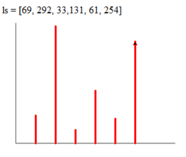

day03刷题

> 44、在考生文件夹下有个文件PY201.py，在横线处填写代码，完成如下功能。根据列表中保存的数据采用turtle库画图直方图，显示输出在屏幕上，效果如下图所示。
>
> 

```python
#
# 在____________上补充代码
# 请不要修改其他代码
#

import turtle as t
ls = [69, 292, 33, 131, 61, 254]
X_len = 400
Y_len = 300
x0 = -200
y0 = -100

t.penup()
t.goto(x0, y0)
t.pendown()

t.fd(X_len)
t.fd(-X_len)
t.seth(90)
t.fd(Y_len)

t.pencolor('red')
t.pensize(5)
for i in range(len(ls)):
    t.penup()
    t.goto(x0 + (i+1)*50, -100)
    t.seth(90)
    t.pendown()
    t.fd(ls[i])
t.done()
```

